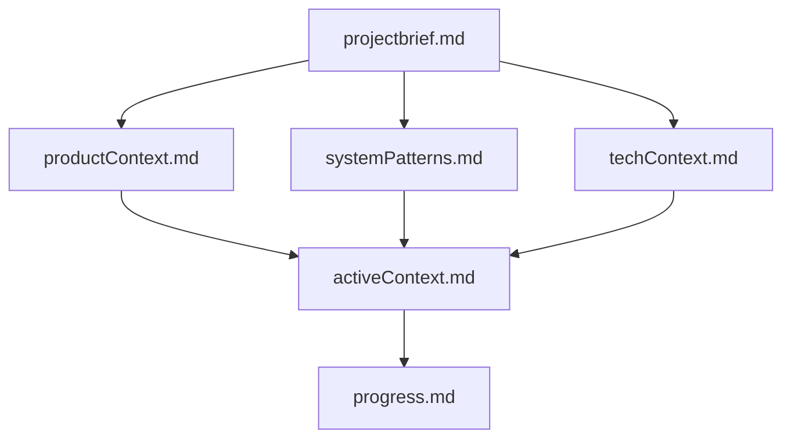

# Memory Bank System

The Memory Bank is a structured documentation system that helps AI assistants maintain context across sessions. It provides a consistent way to store and retrieve project information, ensuring that work can continue seamlessly even when the AI's memory resets.

## Core Files

The Memory Bank consists of six core files that build upon each other in a clear hierarchy:



### 1. `projectbrief.md`

This is the foundation document that shapes all other files. It defines:

- Project goals and objectives
- Core requirements
- Success criteria
- Target audience
- Key stakeholders

**Example Structure:**
```markdown
# Project Brief: [Project Name]

## Overview
[Brief description of the project]

## Objectives
- [Primary objective]
- [Secondary objective]
- ...

## Requirements
- [Core requirement 1]
- [Core requirement 2]
- ...

## Success Criteria
- [Criterion 1]
- [Criterion 2]
- ...

## Target Audience
[Description of the target audience]

## Stakeholders
- [Stakeholder 1]: [Role/Interest]
- [Stakeholder 2]: [Role/Interest]
- ...
```

### 2. `productContext.md`

This file explains why the project exists and how it should work:

- Problems the project solves
- User experience goals
- User journeys
- Key features and their purpose

**Example Structure:**
```markdown
# Product Context: [Project Name]

## Problem Statement
[Description of the problem(s) this project solves]

## User Experience Goals
- [UX goal 1]
- [UX goal 2]
- ...

## User Journeys
1. [User journey 1]
2. [User journey 2]
3. ...

## Key Features
- [Feature 1]: [Purpose]
- [Feature 2]: [Purpose]
- ...
```

### 3. `systemPatterns.md`

This file documents the technical architecture and design patterns:

- System architecture
- Design patterns in use
- Component relationships
- Critical implementation paths

**Example Structure:**
```markdown
# System Patterns: [Project Name]

## Architecture Overview
[Description of the overall architecture]

## Design Patterns
- [Pattern 1]: [Usage in project]
- [Pattern 2]: [Usage in project]
- ...

## Component Relationships
[Description of how components interact]

## Critical Paths
- [Path 1]: [Description]
- [Path 2]: [Description]
- ...
```

### 4. `techContext.md`

This file documents the technical environment and constraints:

- Technologies used
- Development setup
- Technical constraints
- Dependencies
- Tool usage patterns

**Example Structure:**
```markdown
# Technical Context: [Project Name]

## Technology Stack
- Frontend: [Technologies]
- Backend: [Technologies]
- Database: [Technologies]
- Infrastructure: [Technologies]

## Development Environment
[Description of the development environment]

## Technical Constraints
- [Constraint 1]
- [Constraint 2]
- ...

## Dependencies
- [Dependency 1]: [Version] - [Purpose]
- [Dependency 2]: [Version] - [Purpose]
- ...

## Tools
- [Tool 1]: [Usage]
- [Tool 2]: [Usage]
- ...
```

### 5. `activeContext.md`

This file tracks the current work focus and recent changes:

- Current work focus
- Recent changes
- Next steps
- Active decisions and considerations
- Important patterns and preferences
- Learnings and project insights

**Example Structure:**
```markdown
# Active Context: [Project Name]

## Current Focus
[Description of what's currently being worked on]

## Recent Changes
- [Change 1]
- [Change 2]
- ...

## Next Steps
1. [Step 1]
2. [Step 2]
3. ...

## Active Decisions
- [Decision 1]: [Rationale]
- [Decision 2]: [Rationale]
- ...

## Patterns & Preferences
- [Pattern/Preference 1]
- [Pattern/Preference 2]
- ...

## Learnings & Insights
- [Learning/Insight 1]
- [Learning/Insight 2]
- ...
```

### 6. `progress.md`

This file tracks the overall progress of the project:

- What works
- What's left to build
- Current status
- Known issues
- Evolution of project decisions

**Example Structure:**
```markdown
# Progress: [Project Name]

## Completed Features
- [Feature 1]: [Completion date] - [Notes]
- [Feature 2]: [Completion date] - [Notes]
- ...

## In Progress
- [Feature 1]: [Status] - [Notes]
- [Feature 2]: [Status] - [Notes]
- ...

## Planned
- [Feature 1]: [Priority] - [Notes]
- [Feature 2]: [Priority] - [Notes]
- ...

## Known Issues
- [Issue 1]: [Severity] - [Notes]
- [Issue 2]: [Severity] - [Notes]
- ...

## Decision History
- [Date]: [Decision] - [Rationale]
- [Date]: [Decision] - [Rationale]
- ...
```

## Usage Guidelines

### Initial Setup

1. Create the six core files in the `ai-dev-docs/0-memory-bank` directory
2. Fill in the `projectbrief.md` file with the basic project information
3. Gradually populate the other files as the project progresses

### Ongoing Maintenance

1. Update the `activeContext.md` file at the end of each work session
2. Update the `progress.md` file whenever significant progress is made
3. Update the other files as needed when the project evolves
4. Use the `!update-memory-bank` command to have the AI review and update all memory bank files

### Best Practices

1. Be concise but comprehensive
2. Use bullet points and numbered lists for clarity
3. Update regularly to ensure the information is current
4. Cross-reference between files when appropriate
5. Use the memory bank as the single source of truth for project information

## Integration with Project Transitions

The Memory Bank system integrates with the Project Transitions system:

1. When using `!project-snapshot`, the memory bank is included in the snapshot
2. When using `!switch-to`, the memory bank is loaded from the snapshot
3. When using `!update-memory-bank`, all memory bank files are updated

This ensures that project context is maintained across transitions and that the memory bank is always up to date.
